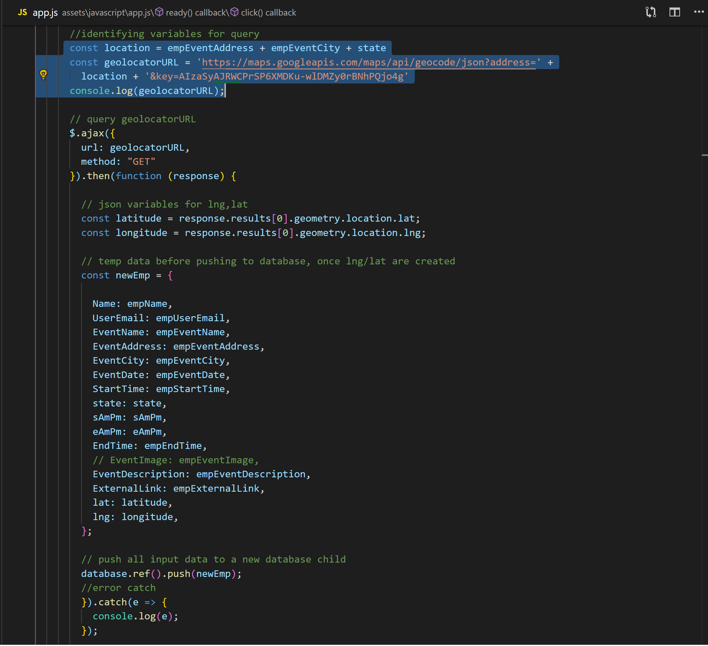
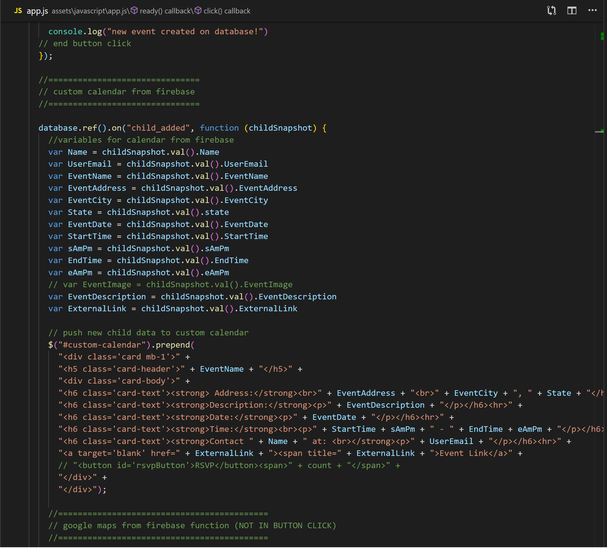
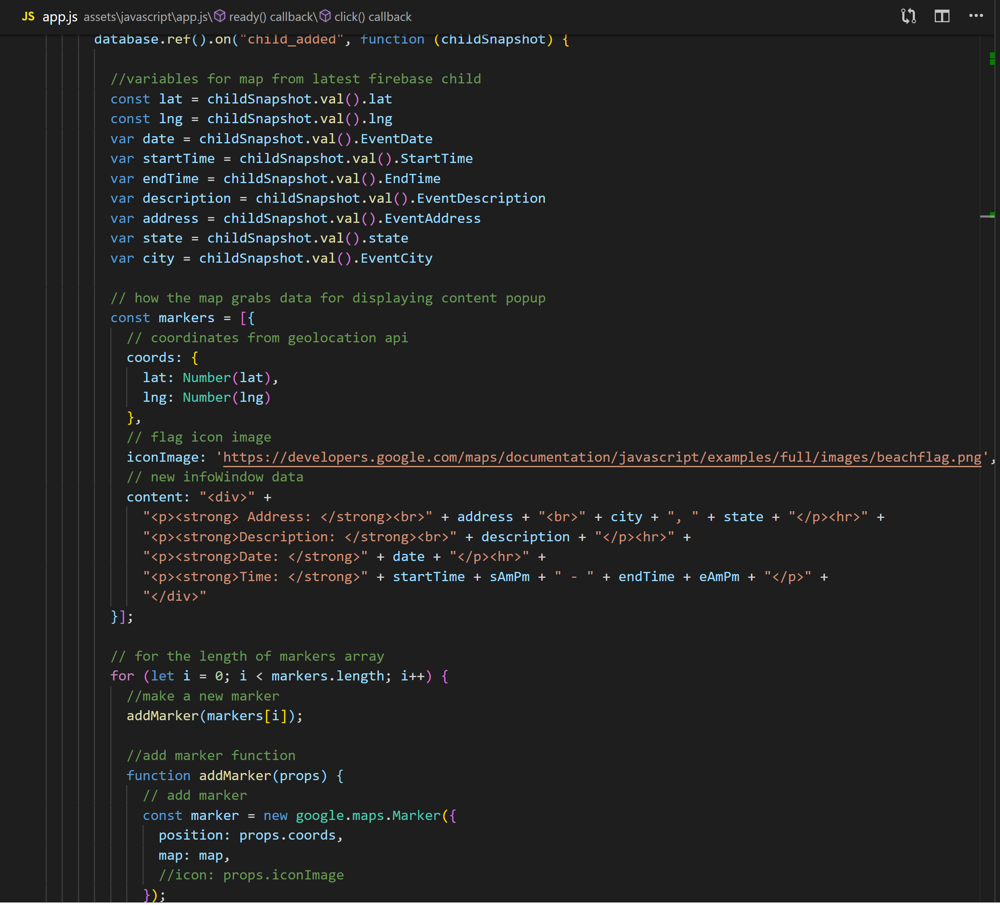

## EventLand!! 
### A event creator and viewer
[It's Live!](http://nt5k.github.io/EventLand) 

* This application was built with Bootstrap, Javascript, jQuery, AJAX, Cleave.js, Google Maps and Geolocator API's
* User input form info is stored in Firebase then retrieved and displayed inside a custom calendar and on a map!

*Instructions for creating new event:*  

1. Click "Create new event" button at top of screen. This form will pop up.
2. Fill out form completely or it will not submit.
3. Once form is filled, click "Submit Event!" button and form will push to firebase
4. The new event will populate inside the custom calendar and on the google map  

*How the data is stored inside Firebase example:*  

*before the data is stored on firebase, it first querys the google geolocator api for longitude and latitude:*  

*How the app displays data on the page:*  

* Once the data is stored in firebase, there are two listeners attached to the database.
  - One for the custom calendar  
    
  - One to populate the map  
    
